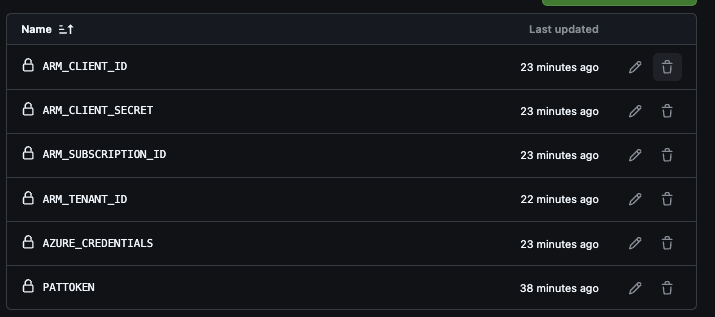
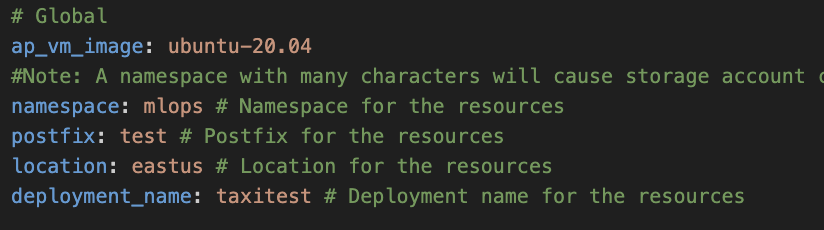

# Azure MLOps (v2) solution accelerator

[Main README file](https://github.com/Azure/mlops-v2/blob/main/README.md)

Antes que todo, se debe ejecutar esto en la CLI de Azure:
```python
projectName="<Name>"
roleName="Contributor"
subscriptionId="<Id>"
environment="Prod" #First letter should be capitalized
servicePrincipalName="Azure-ARM-${environment}-${projectName}"
# Verify the ID of the active subscription
echo "Using subscription ID $subscriptionId"
echo "Creating SP for RBAC with name $servicePrincipalName, with role $roleName and in scopes     /subscriptions/$subscriptionId"
az ad sp create-for-rbac --name $servicePrincipalName --role $roleName --scopes /subscriptions/$subscriptionId --json-auth 
echo "Please ensure that the information created here is properly save for future use."
```
Asignando un nombre nuevo y el Id correspondiente

Se debe guardar lo imprimido en pantalla y guardar en los secretos correspondientes:



Por otro lado, se debe modificar el archivo `config-infra-prod.yml`, sólo modificando `namespace`, `postfix`, `location` y `deployment_name`.

